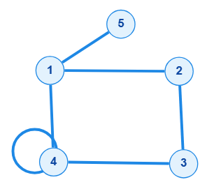
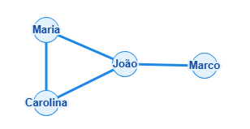
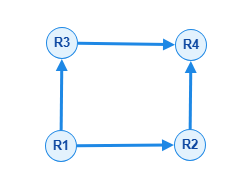
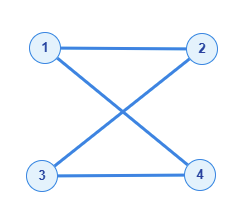

# Material do Estudante - Prática de Grafos

**Disciplina:** Estrutura de Dados II\
**Unidade III:** Grafos\
**Professora:** Kadidja Valéria\
**Conteúdo-base:** Capítulo 1 - Conceitos Fundamentais\
**Duração prevista:** atividades distribuídas ao longo da aula de 2
horas

------------------------------------------------------------------------

## 1. Objetivos da prática

Ao final das atividades, você deverá ser capaz de:

-   representar problemas utilizando grafos;
-   identificar vértices e arestas;
-   reconhecer incidência e adjacência;
-   diferenciar grafos não dirigidos e grafos dirigidos;
-   determinar ordem, tamanho e grau de vértices;
-   reconhecer laços e arestas paralelas;
-   analisar isomorfismo e subgrafos;
-   construir e conferir sequências de graus;
-   utilizar ferramentas digitais para representar grafos.

------------------------------------------------------------------------

## 2. Orientações gerais

1.  Leia o enunciado antes de iniciar o desenho.
2.  Quando solicitado, registre primeiro os conjuntos de vértices `V` e
    de arestas `E`.
3.  Utilize círculos ou pontos para representar vértices e linhas/setas
    para representar arestas.
4.  Em grafos dirigidos, a seta deve indicar claramente a origem e o
    destino.
5.  Não entregue somente o desenho: apresente também as respostas e
    justificativas solicitadas.
6.  Quando utilizar uma plataforma digital, registre uma captura de tela
    ou o link da atividade.

------------------------------------------------------------------------
# 3. ATIVIDADES:

## Atividade 1 - Desenhando um grafo

### Proposta

Considere:

`V = {1, 2, 3, 4, 5}`

`E = {(1,2), (1,4), (1,5), (2,3), (3,4), (4,4)}`

### Faça

1.  Desenhe o grafo.
2.  Identifique o número de vértices.
3.  Identifique o número de arestas.
4.  Determine a ordem `|V|`.
5.  Determine o tamanho `|E|`.
6.  Identifique se existe laço.
7.  Determine o grau de cada vértice.

> **Atenção:** a aresta `(4,4)` é um laço. No cálculo do grau, um laço é
> contado duas vezes.

### Plataformas

-   papel e lápis;
-   Graph Online;
-   diagrams.net;
-   Graphviz;
-   Google Colab com Python e NetworkX.

## Resposta:

1. 
2. V = 5
3. E = 6
4. `|V|` = 5
5. `|E|` = 6
6. Existe um laço na veertice 4
7. Grau de Cada Vertice:
- 1 = 3
- 2 = 2
- 3 = 2
- 4 = 4
- 5 = 1

------------------------------------------------------------------------

## Atividade 2 - Incidência e adjacência

Utilize o grafo construído na Atividade 1.

### Faça

1.  Liste os vértices adjacentes a cada vértice.
2.  Informe quais arestas são incidentes em cada vértice.
3.  Escolha dois vértices adjacentes e explique por que são considerados
    vizinhos.
4.  Escolha dois vértices não adjacentes e justifique sua resposta.

### Registro

  Vértice   Vértices adjacentes   Arestas incidentes
  --------- --------------------- --------------------
  1                               
  2                               
  3                               
  4                               
  5                               

### Plataformas

-   papel;
-   Graph Online;
-   diagrams.net;
-   quadro colaborativo indicado pela professora.

## Resposta:
1. 
| Vértice | Vértices adjacentes | Arestas incidentes          |
|---------|---------------------|-----------------------------|
| 1       | 2, 4, 5             | (1,2), (1,4), (1,5)         |
| 2       | 1, 3                | (1,2), (2,3)                |
| 3       | 2, 4                | (2,3), (3,4)                |
| 4       | 1, 3, 4             | (1,4), (3,4), (4,4)         |
| 5       | 1                   | (1,5)                       | \n
2. Os vértices 2 e 4 são vizinhos porque eles possuem uma ligação direta.
3. Os vértices 3 e 5 não são vizinhos porque eles não possuem uma ligação direta.

------------------------------------------------------------------------

## Atividade 3 - Modelagem de uma rede de amizades

Considere quatro pessoas:

**João, Carolina, Maria e Marco.**

### Situação

Crie uma pequena rede de amizades entre essas pessoas.

### Faça

1.  Defina o conjunto de vértices `V`.
2.  Defina o conjunto de arestas `E`.
3.  Desenhe o grafo correspondente.
4.  Informe se o grafo deve ser dirigido ou não dirigido.
5.  Justifique a escolha.
6.  Identifique quem possui maior grau no grafo criado.

### Questão para reflexão

**O que os vértices e as arestas representam nesse problema?**

### Plataformas

-   diagrams.net;
-   Graph Online;
-   Canva;
-   papel;
-   Google Colab com NetworkX.

## Resposta:
1. V = {João, Carolina, Maria, Marco}
2. E = {(João, Carolina), (João, Maria), (João, Marco), (Carolina, Maria)}
3.   
As Vertices representam as pessoas e as Arestas representam as amizades. 
5. O grafo não é dirigido.
6. Ele é um grafo com Relação Simetrica
7. Maior Grau: João(3)

------------------------------------------------------------------------

## Atividade 4 - Modelagem de ruas de mão única

### Situação

Considere um pequeno sistema urbano formado por cruzamentos e ruas de
mão única.

### Faça

1.  Represente cada cruzamento ou ponto relevante por um vértice.
2.  Represente cada rua por uma aresta dirigida.
3.  Utilize setas para indicar o sentido permitido.
4.  Defina os conjuntos `V` e `E`.
5.  Escolha um vértice e determine:
    -   seu grau de entrada;
    -   seu grau de saída.
6.  Explique por que um grafo não dirigido não representa adequadamente
    essa situação.

### Plataformas

-   diagrams.net;
-   Graph Online;
-   Graphviz;
-   Google Colab com NetworkX.

## Resposta:

1.  
2.  Conjuntos  
    - V = {R1, R2, R3, R4}
    - E = {(R1, R2), (R1, R3), (R2, R4), (R3, R4)}
4.  vértice R1:
    -   Grau de entrada: 0
    -   Grau de saída: 2
5.  O Grafo não dirigido não representa adequadamente essa situação porque ele não possui direção nas arestas, impossibilitando que o sentido da via seja mostrado no grafo.

------------------------------------------------------------------------

## Atividade 5 - Desafio de isomorfismo

A professora apresentará dois grafos para comparação.

### Faça

1. Determine a ordem e o tamanho de cada grafo.
2. Calcule o grau de cada vértice e escreva a sequência de graus de G e H.
3. Procure uma correspondência entre os vértices de G e os de H.
4. Verifique, aresta por aresta, se a correspondência preserva as adjacências.
5. Conclua se os grafos são isomorfos e justifique.

### Registro sugerido

  Vértice do grafo G   Vértice correspondente no grafo H
  -------------------- -----------------------------------
                       
                       
                       
                       

> Não considere apenas a aparência dos desenhos. Grafos desenhados de
> formas diferentes podem apresentar a mesma estrutura.

### Plataformas

-   papel;
-   Graph Online;
-   diagrams.net.

## Resposta:

1.
   Grafo G:  
       - Ordem: 4  
       - Tamanho: 4  
   Grafo H:  
       - Ordem: 4  
       - Tamanho: 4
3. | Vértice do grafo G | Vértice correspondente no grafo H |
   |--------------------|-----------------------------------|
   | 1                  | a                                 |
   | 2                  | c                                 |
   | 3                  | b                                 |
   | 4                  | d                                 |
4. Os vértices dos grafos G e H possuem os mesmos graus 
5. Sim, a correspondências preserva a adjacência
6. Os grafos são isomorfos porque ambos possuem a mesma quantidade de vértices, arestas, e grau.
Grafos:  
  
.png)

------------------------------------------------------------------------

## Atividade 6 - Construindo subgrafos

A partir do grafo `G` indicado pela professora, construa **dois
subgrafos diferentes**.

### Para cada subgrafo

1.  informe o conjunto de vértices;
2.  informe o conjunto de arestas;
3.  desenhe o subgrafo;
4.  confirme que seus vértices e arestas pertencem ao grafo original.

### Registro

**Subgrafo G1**

`V1 = { }`

`E1 = { }`

**Subgrafo G2**

`V2 = { }`

`E2 = { }`

### Plataformas

-   Graph Online;
-   diagrams.net;
-   papel;
-   Google Colab com NetworkX.

------------------------------------------------------------------------

## Atividade 7 - Desafio da sequência de graus

Construa um **grafo simples** de acordo com a sequência de graus
indicada pela professora.

### Faça

1.  Crie os vértices necessários.
2.  Adicione as arestas progressivamente.
3.  Calcule o grau de cada vértice.
4.  Organize os graus em ordem não decrescente.
5.  Compare a sequência obtida com a sequência solicitada.
6.  Caso não coincida, revise as arestas.

### Registro

  Vértice     Grau
  --------- ------
            
            
            
            

**Sequência final de graus:** `( ______________________________ )`

### Plataformas

-   papel;
-   Graph Online;
-   Python/NetworkX no Google Colab.

------------------------------------------------------------------------

## 4. Plataformas recomendadas

### Graph Online

Indicado para construção visual rápida de grafos e exploração das
conexões.

### diagrams.net

Indicado para desenhar grafos, redes, mapas simplificados e modelos de
situações-problema.

### Graphviz

Indicado para representar grafos por meio de uma descrição
textual/código.

### Google Colab + Python/NetworkX

Indicado para relacionar os conceitos da Teoria dos Grafos à
implementação computacional.

### Canva

Pode ser utilizado nas atividades de modelagem predominantemente visual.

### Papel e lápis

Continua sendo uma opção adequada para os exercícios conceituais e para
os primeiros esboços.

------------------------------------------------------------------------

## 5. Entrega das atividades

Ao final da aula, entregue **um único documento** contendo:

-   nome do estudante ou integrantes da dupla;
-   identificação das atividades;
-   desenhos dos grafos;
-   conjuntos `V` e `E`, quando solicitados;
-   cálculos;
-   respostas;
-   justificativas;
-   captura de tela ou link, quando utilizada uma plataforma digital.

------------------------------------------------------------------------

## 6. Checklist de revisão

-   `✔` Identifiquei corretamente vértices e arestas.
-   `✔` Diferenciei grafo dirigido e não dirigido.
-   `✔` Identifiquei incidência e adjacência.
-   `✔` Calculei os graus quando solicitado.
-   `✔` Considerei o laço corretamente no cálculo do grau.
-   `✔` Utilizei setas nos grafos dirigidos.
-   `✔` Justifiquei a análise de isomorfismo.
-   `✔` Identifiquei corretamente os subgrafos.
-   `✔` Conferi a sequência de graus.
-   `✔` Revisei os desenhos e as justificativas.
-   `✔` Registrei a plataforma utilizada.

------------------------------------------------------------------------

## 7. Referência

GOMES, Paulo César Rodacki. **Grafos: conceitos fundamentais, algoritmos
e aplicações**. Blumenau: Editora IFC, 2022.

Material de apoio elaborado a partir do **Capítulo 1 - Conceitos
Fundamentais**.
